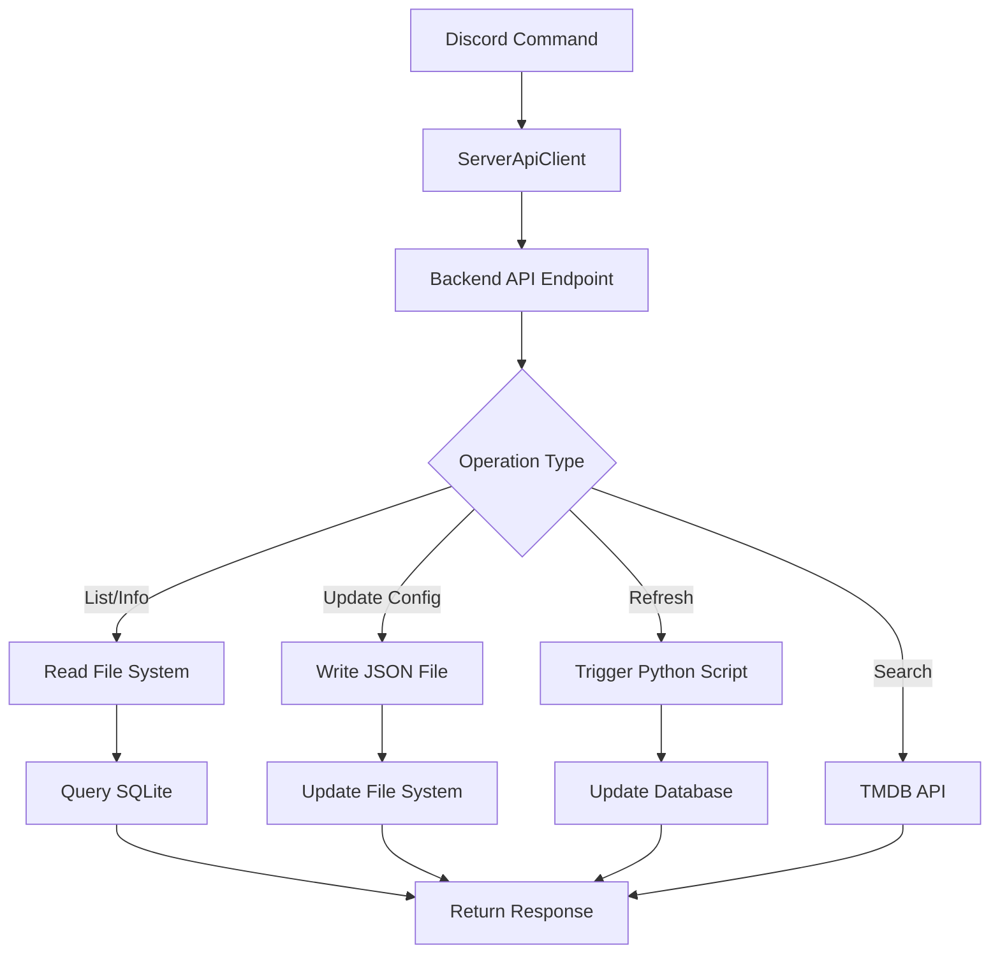

# Discord Media Administration Commands - Implementation Plan

## Overview

This plan outlines the implementation of Discord slash commands for managing media library metadata through `tmdb.config` files. These admin-only commands will enable efficient media management directly from Discord.

## Understanding tmdb.config

### File Location
Each media item has its own config file:
- **Movies**: `/var/www/html/movies/{Movie Name}/tmdb.config`
- **TV Shows**: `/var/www/html/tv/{Show Name}/tmdb.config`

### File Structure

```json
{
  "tmdb_id": 603,
  "update_metadata": true,
  "metadata": {
    "title": "Custom Title Override",
    "overview": "Custom description..."
  },
  "override_poster": "/9gk7adHYeDvHkCSEqAvQNLV5Uge.jpg",
  "override_backdrop": "/zuW6fOiusv4X9nnW3paHGfXcSll.jpg",
  "override_logo": "/logo.png"
}
```

### Config Properties

| Property | Type | Purpose | Example |
|----------|------|---------|---------|
| `tmdb_id` | number | TMDB database ID | `603` |
| `update_metadata` | boolean | Enable/disable auto-updates | `true` |
| `metadata` | object | Override any metadata field | `{"title": "..."}` |
| `override_poster` | string | Custom poster image path | `"/path.jpg"` |
| `override_backdrop` | string | Custom backdrop image path | `"/path.jpg"` |
| `override_logo` | string | Custom logo image path | `"/path.png"` |

## Proposed Discord Commands

### 1. `/media list` - List Media Items

**Purpose**: Browse available movies/TV shows with pagination

**Options**:
- `type` (required): "movie" or "tv"
- `page` (optional): Page number (default: 1)
- `search` (optional): Filter by name
- `missing_config` (optional): Show only items without tmdb.config

**Example Usage**:
```
/media list type:movie page:1
/media list type:tv search:Breaking
/media list type:movie missing_config:true
```

**Output**:
```
📁 Movies - Page 1/25 (250 total)

1. The Matrix (1999) ✅
   ID: 603 | Auto-update: ON
   
2. Inception (2010) ✅
   ID: 27205 | Auto-update: ON

3. Interstellar (2014) ⚠️
   Missing tmdb.config

💡 Use /media info to view details
Page 1/25 • 10 items per page
```

### 2. `/media info` - View Media Config

**Purpose**: Display complete tmdb.config for a media item

**Options**:
- `type` (required): "movie" or "tv"
- `name` (required): Media name (autocomplete from database)

**Example**:
```
/media info type:movie name:"The Matrix"
```

**Output**:
```
🎬 The Matrix (1999)

📋 TMDB Configuration
TMDB ID: 603
Auto-updates: ✅ Enabled
Config file: /var/www/html/movies/The Matrix/tmdb.config

🔧 Metadata Overrides
None

🖼️ Image Overrides
None

📊 Database Info
Cached in: metadataHashes.db
Last updated: 2 days ago
Blurhash available: Yes

🔗 TMDB: https://www.themoviedb.org/movie/603
```

### 3. `/media set-id` - Set/Update TMDB ID

**Purpose**: Set or change the TMDB ID for a media item

**Options**:
- `type` (required): "movie" or "tv"
- `name` (required): Media name
- `tmdb_id` (required): New TMDB ID

**Example**:
```
/media set-id type:movie name:"The Matrix" tmdb_id:603
```

**Output**:
```
✅ TMDB ID Updated

Movie: The Matrix
Old ID: None
New ID: 603

📁 Config file created/updated:
/var/www/html/movies/The Matrix/tmdb.config

💡 Tip: Run /media refresh to update metadata now
```

### 4. `/media toggle-updates` - Enable/Disable Auto-Updates

**Purpose**: Control automatic metadata synchronization

**Options**:
- `type` (required): "movie" or "tv"
- `name` (required): Media name
- `enabled` (required): true or false

**Example**:
```
/media toggle-updates type:movie name:"The Matrix" enabled:false
```

**Output**:
```
🔄 Auto-updates Disabled

Movie: The Matrix
Auto-updates: ❌ Disabled

Metadata will no longer be automatically updated from TMDB.
Manual overrides will be preserved.

💡 Use /media refresh to manually update when needed
```

### 5. `/media search-tmdb` - Search TMDB Database

**Purpose**: Find correct TMDB ID for a media item

**Options**:
- `type` (required): "movie" or "tv"
- `query` (required): Search term
- `year` (optional): Release year for better matching

**Example**:
```
/media search-tmdb type:movie query:"The Matrix" year:1999
```

**Output**:
```
🔍 TMDB Search Results for "The Matrix"

1. The Matrix (1999) ⭐ 8.7/10
   ID: 603
   A computer hacker learns from mysterious rebels about the true nature...
   [Set as ID] button

2. The Matrix Reloaded (2003) ⭐ 7.1/10
   ID: 604
   Six months after the events depicted in The Matrix...
   [Set as ID] button

3. The Matrix Resurrections (2021) ⭐ 6.7/10
   ID: 624860
   Plagued by strange memories, Neo's life takes an unexpected turn...
   [Set as ID] button

Found 12 results • Showing top 3
Use page option to see more

💡 Click [Set as ID] to update tmdb.config
```

### 6. `/media refresh` - Force Metadata Refresh

**Purpose**: Manually trigger metadata update for a media item

**Options**:
- `type` (required): "movie" or "tv"
- `name` (required): Media name
- `force` (optional): Ignore auto-update setting

**Example**:
```
/media refresh type:movie name:"The Matrix"
```

**Output**:
```
🔄 Refreshing Metadata...

Movie: The Matrix (ID: 603)

⏳ Fetching from TMDB...
✅ Downloaded metadata
✅ Downloaded poster
✅ Downloaded backdrop  
✅ Generated blurhash
✅ Updated database cache

📊 Updated Fields:
- Title: The Matrix
- Overview: Updated
- Release date: 1999-03-31
- Runtime: 136 minutes
- Rating: R
- Cast: 15 members

Last updated: Just now
```

### 7. `/media override` - Set Metadata/Image Override

**Purpose**: Manually override specific metadata fields or images

**Options**:
- `type` (required): "movie" or "tv"
- `name` (required): Media name
- `field` (required): Field to override (title, overview, poster, backdrop, logo)
- `value` (required): New value

**Example**:
```
/media override type:movie name:"The Matrix" field:title value:"The Matrix (Remastered)"
/media override type:movie name:"The Matrix" field:poster value:"/custom/poster.jpg"
```

**Output**:
```
✅ Override Applied

Movie: The Matrix
Field: title
New value: The Matrix (Remastered)

📝 Override saved to tmdb.config
Auto-updates are still enabled - this override will persist

💡 To remove override, use /media remove-override
```

### 8. `/media remove-override` - Remove Override

**Purpose**: Remove a specific metadata or image override

**Options**:
- `type` (required): "movie" or "tv"
- `name` (required): Media name
- `field` (required): Field to stop overriding

**Example**:
```
/media remove-override type:movie name:"The Matrix" field:title
```

### 9. `/media bulk-scan` - Scan Media Directory

**Purpose**: Scan media directories for items missing tmdb.config

**Options**:
- `type` (required): "movie" or "tv"
- `auto_match` (optional): Automatically set IDs for >90% matches

**Example**:
```
/media bulk-scan type:movie auto_match:true
```

**Output**:
```
🔍 Scanning Movie Directory...

Found: 250 movies
With config: 245 (98%)
Missing config: 5 (2%)

Missing tmdb.config:
1. Unknown Movie (2020) - No match found
2. Test Film - No match found
3. Sample Movie - Auto-matched: 12345 ✅
4. Demo Video - No match found
5. Example (2021) - Auto-matched: 67890 ✅

✅ Auto-matched: 2
⚠️ Manual review needed: 3

💡 Use /media list missing_config:true to review
```

### 10. `/tasks` - View Active Tasks (Admin Only)

**Purpose**: Monitor background processing tasks

**Options**:
- `detailed` (optional): Show full task information
- `type` (optional): Filter by task type

**Example**:
```
/tasks
/tasks detailed:true type:media_scan
```

**Output**:
```
📊 Background Tasks

⚙️ Active Tasks (2)
• Media Scan (Movie) - Running 45s
• TMDB Download - Running 12s

📋 Task Queues
• API Requests: 0
• Media Scans: 0
• TMDB Downloads: 3 queued
• Blurhash: 1 queued
• Cache Cleanup: 0

Last updated: Just now
```

## Backend Implementation Requirements

### New API Endpoints

All endpoints require admin authentication (`X-Webhook-ID` or admin user check)

#### 1. `GET /api/admin/media/list`

**Query Parameters**:
- `type`: "movie" | "tv"
- `page`: number (default: 1)
- `search`: string (optional)
- `missingConfig`: boolean (optional)

**Response**:
```json
{
  "success": true,
  "items": [
    {
      "name": "The Matrix",
      "path": "/var/www/html/movies/The Matrix",
      "hasConfig": true,
      "config": {
        "tmdb_id": 603,
        "update_metadata": true
      },
      "metadata": {
        "title": "The Matrix",
        "year": 1999,
        "cached": true,
        "lastUpdated": "2025-01-15T10:00:00.000Z"
      }
    }
  ],
  "pagination": {
    "page": 1,
    "perPage": 10,
    "total": 250,
    "totalPages": 25
  }
}
```

#### 2. `GET /api/admin/media/info`

**Query Parameters**:
- `type`: "movie" | "tv"
- `name`: string

**Response**:
```json
{
  "success": true,
  "media": {
    "name": "The Matrix",
    "type": "movie",
    "path": "/var/www/html/movies/The Matrix",
    "config": {
      "tmdb_id": 603,
      "update_metadata": true,
      "metadata": {},
      "override_poster": null,
      "override_backdrop": null,
      "override_logo": null
    },
    "files": {
      "video": "The Matrix (1999).mp4",
      "config": "tmdb.config",
      "metadata": "metadata.json"
    },
    "database": {
      "hasBlurhash": true,
      "hasMetadata": true,
      "lastUpdated": "2025-01-15T10:00:00.000Z"
    }
  }
}
```

#### 3. `POST /api/admin/media/set-id`

**Body**:
```json
{
  "type": "movie",
  "name": "The Matrix",
  "tmdb_id": 603
}
```

**Response**:
```json
{
  "success": true,
  "message": "TMDB ID updated successfully",
  "config": {
    "tmdb_id": 603,
    "update_metadata": true
  },
  "configPath": "/var/www/html/movies/The Matrix/tmdb.config"
}
```

#### 4. `POST /api/admin/media/toggle-updates`

**Body**:
```json
{
  "type": "movie",
  "name": "The Matrix",
  "enabled": false
}
```

#### 5. `POST /api/admin/media/refresh`

**Body**:
```json
{
  "type": "movie",
  "name": "The Matrix",
  "force": false
}
```

Triggers Python script or Node.js equivalent to refresh metadata.

#### 6. `POST /api/admin/media/set-override`

**Body**:
```json
{
  "type": "movie",
  "name": "The Matrix",
  "field": "title",
  "value": "The Matrix (Remastered)"
}
```

#### 7. `DELETE /api/admin/media/remove-override`

**Query Parameters**:
- `type`, `name`, `field`

#### 8. `POST /api/admin/media/bulk-scan`

**Body**:
```json
{
  "type": "movie",
  "autoMatch": true,
  "matchThreshold": 90
}
```

Returns list of items scanned, matched, and needing review.

#### 9. `GET /api/tasks` (Already planned)

Returns task manager status.

## Database Integration

### Media Metadata Sources

1. **SQLite - metadataHashes.db**: Stores metadata hashes and cached info
2. **File System**: Read tmdb.config files directly
3. **TMDB API**: For search and metadata refresh

### Data Flow



## Interactive Features

### Button Actions

Some commands should include interactive buttons for common follow-up actions:

**Search Results Example**:
```javascript
const row = new ActionRowBuilder()
  .addComponents(
    new ButtonBuilder()
      .setCustomId(`set_tmdb_id:movie:The Matrix:603`)
      .setLabel('Set as ID')
      .setStyle(ButtonStyle.Primary),
    new ButtonBuilder()
      .setCustomId(`view_tmdb:603`)
      .setLabel('View on TMDB')
      .setStyle(ButtonStyle.Link)
      .setURL('https://www.themoviedb.org/movie/603')
  );
```

### Autocomplete

For the `name` parameter, implement autocomplete by:
1. Reading available media from file system
2. Querying SQLite database for cached names
3. Filtering based on user input
4. Returning top 25 matches

```javascript
async function handleAutocomplete(interaction) {
  const focusedOption = interaction.options.getFocused(true);
  
  if (focusedOption.name === 'name') {
    const type = interaction.options.getString('type');
    const query = focusedOption.value.toLowerCase();
    
    // Get media list from backend
    const mediaList = await getMediaList(type, query);
    
    // Return filtered choices
    const choices = mediaList
      .filter(m => m.name.toLowerCase().includes(query))
      .slice(0, 25)
      .map(m => ({ name: m.name, value: m.name }));
    
    await interaction.respond(choices);
  }
}
```

## Permission System

### Admin Verification via MongoDB

All media commands require admin privileges verified through the MongoDB frontend database. The admin status is stored in the `Users.AuthenticatedUsers` collection with an `admin` field.

**Authentication Flow:**
1. Discord bot sends command with Discord User ID
2. Backend receives webhook authentication (X-Webhook-ID)
3. Backend looks up Discord User ID in MongoDB to find associated frontend user
4. Backend checks if `user.admin === true`
5. Only admin users can execute media management commands

**Implementation in Backend** (`node/middleware/auth.mjs`):

```javascript
import { authenticateWithSessionToken, authenticateWithMobileToken } from '../database.mjs';

/**
 * Middleware to require admin privileges
 * Checks MongoDB Users.AuthenticatedUsers.admin field
 */
export async function requireAdmin(req, res, next) {
  // User should already be authenticated by authenticateUser middleware
  if (!req.user) {
    return res.status(401).json({ error: 'Authentication required' });
  }
  
  // Check if user has admin privileges (from MongoDB)
  if (!req.user.admin) {
    logger.warn(`Non-admin user ${req.user.email} attempted admin action`);
    return res.status(403).json({
      error: 'Admin privileges required',
      message: 'This operation requires administrator access'
    });
  }
  
  next();
}
```

**Discord User ID Mapping:**

For Discord bot commands, we need to map Discord User IDs to frontend users. Add a new field to MongoDB:

```javascript
// Add to Users.AuthenticatedUsers collection
{
  _id: ObjectId("..."),
  email: "admin@example.com",
  name: "Admin User",
  admin: true,
  discordUserId: "123456789012345678"  // NEW: Discord User ID
}
```

**Backend Endpoint Example:**

```javascript
// node/routes/mediaAdmin.mjs
import { authenticateUser, requireAdmin } from '../middleware/auth.mjs';

router.get('/admin/media/list', authenticateUser, requireAdmin, async (req, res) => {
  // req.user.admin is guaranteed to be true here
  // User's email and name available for audit logging
  logger.info(`Admin ${req.user.email} requested media list`);
  
  // ... implementation
});
```

**Discord Command Permission Check:**

In Discord commands, we'll pass the Discord User ID to the backend:

```javascript
// In Discord command (e.g., commands/media.mjs)
export async function execute(interaction, client) {
  await interaction.deferReply({ ephemeral: true });
  
  try {
    const apiClient = new ServerApiClient(
      client.botAdapter.serverApiUrl,
      client.botAdapter.serverApiKey
    );
    
    // Pass Discord User ID to backend for admin verification
    const result = await apiClient.getMediaList({
      type: 'movie',
      discordUserId: interaction.user.id  // Discord User ID
    });
    
    // ... handle response
  } catch (error) {
    if (error.response?.status === 403) {
      return interaction.editReply({
        content: '❌ Admin privileges required\n\nThis command is restricted to administrators.',
        ephemeral: true
      });
    }
    // ... other error handling
  }
}
```

**MongoDB Admin Lookup Function:**

Add to `node/database.mjs`:

```javascript
/**
 * Get user by Discord ID and verify admin status
 * @param {string} discordUserId - Discord User ID
 * @returns {Object|null} User object or null if not found/not admin
 */
export async function getAdminByDiscordId(discordUserId) {
  const client = new MongoClient(uri);
  try {
    await client.connect();
    const db = client.db("Users");
    
    const user = await db.collection("AuthenticatedUsers").findOne({
      discordUserId: discordUserId,
      admin: true  // Must be admin
    });
    
    if (!user) return null;
    
    return {
      id: user._id.toString(),
      email: user.email,
      name: user.name,
      image: user.image,
      admin: user.admin,
      discordUserId: user.discordUserId
    };
  } catch (error) {
    logger.error("Error getting admin by Discord ID:" + error);
    return null;
  } finally {
    await client.close();
  }
}
```

**Benefits of MongoDB Admin Verification:**

1. **Centralized**: Single source of truth for user permissions
2. **Consistent**: Same admin system used across all frontends
3. **Flexible**: Easy to add/remove admin privileges without code changes
4. **Auditable**: All admin actions tied to frontend user accounts
5. **Secure**: No hardcoded admin lists in environment variables
6. **Scalable**: Support unlimited admins without config changes

**Setup Required:**

1. Add `discordUserId` field to existing admin users in MongoDB
2. Create UI in frontend to link Discord accounts to users
3. Implement `getAdminByDiscordId()` in database.mjs
4. Update backend endpoints to accept discordUserId parameter
5. Update Discord commands to pass interaction.user.id

**Alternative: Webhook-only Mode (No User Linking)**

If you don't want to link Discord IDs to users, use environment variable fallback:

```javascript
// Check MongoDB first, then env variable
const isAdmin = await getAdminByDiscordId(discordUserId) ||
                (process.env.DISCORD_ADMIN_USERS || '').split(',').includes(discordUserId);
```

## Implementation Priority

### Phase 1: Core Infrastructure (Week 1)
1. ✅ Create backend API endpoints for media operations
2. ✅ Implement file system operations (read/write tmdb.config)
3. ✅ Add admin authentication middleware
4. ✅ Extend ServerApiClient with media methods
5. ✅ Create `/tasks` command

### Phase 2: Basic Media Commands (Week 2)
6. ✅ Implement `/media list` command
7. ✅ Implement `/media info` command
8. ✅ Implement `/media set-id` command
9. ✅ Implement `/media toggle-updates` command

### Phase 3: Advanced Features (Week 3)
10. ✅ Implement `/media search-tmdb` with buttons
11. ✅ Implement `/media refresh` command
12. ✅ Implement `/media override` and `/media remove-override`
13. ✅ Add autocomplete for media names

### Phase 4: Bulk Operations (Week 4)
14. ✅ Implement `/media bulk-scan` command
15. ✅ Add pagination for list views
16. ✅ Comprehensive testing
17. ✅ Documentation updates

## File Structure

```
node/
├── routes/
│   └── mediaAdmin.mjs          # New admin media routes
├── integrations/discord/
│   ├── commands/
│   │   ├── tasks.mjs           # Task monitoring command
│   │   └── media.mjs           # Media management command suite
│   ├── events/
│   │   └── autocomplete.mjs    # Handle autocomplete interactions
│   └── utils/
│       └── serverApi.mjs       # Extended with media methods
└── utils/
    ├── mediaConfig.mjs         # tmdb.config operations
    └── fileSystem.mjs          # File system utilities
```

## Error Handling

### Common Scenarios

1. **Media Item Not Found**:
```
❌ Media Not Found

Could not find movie "Unknown Title"

💡 Tips:
- Check spelling
- Use /media list to browse available items
- Path: /var/www/html/movies/Unknown Title
```

2. **Invalid TMDB ID**:
```
❌ Invalid TMDB ID

ID 999999 does not exist in TMDB database

💡 Use /media search-tmdb to find the correct ID
```

3. **Permission Denied**:
```
❌ Permission Denied

Cannot write to: /var/www/html/movies/The Matrix/tmdb.config

Check file system permissions.
```

4. **Auto-updates Disabled Warning**:
```
⚠️ Auto-updates Disabled

This media item has auto-updates disabled.
Metadata will not be refreshed automatically.

Use force:true to override this setting.
```

## Benefits of This Approach

1. **Efficiency**: Manage hundreds of media items without SSH/file access
2. **Team Collaboration**: Multiple admins can manage media from Discord
3. **Mobile Friendly**: Full functionality from Discord mobile app
4. **Audit Trail**: Discord logs all admin actions
5. **Centralized**: One interface for all media management
6. **Searchable**: Full TMDB search integration
7. **Safe**: Admin-only with confirmation for destructive actions
8. **Fast**: Leverages existing SQLite caches

## Security Considerations

1. **Admin Only**: All commands require verified admin status
2. **Path Validation**: Prevent directory traversal attacks
3. **Input Sanitization**: Validate all user inputs
4. **Rate Limiting**: Limit bulk operations to prevent abuse
5. **Logging**: Log all config changes with user ID
6. **Backup**: Backup tmdb.config before modifications

## Next Steps

1. Review and approve this plan
2. Switch to Code mode to implement Phase 1
3. Test each command incrementally
4. Document usage in README
5. Create admin onboarding guide

## Questions to Resolve

1. Should we create automatic backups of tmdb.config files before modification?
2. Should `/media refresh` trigger the Python script directly or queue it as a task?
3. Should we add a `/media validate` command to check config file integrity?
4. Should we support batch operations (e.g., set ID for multiple items at once)?
5. Should we add a `/media export` command to export all configs as JSON?