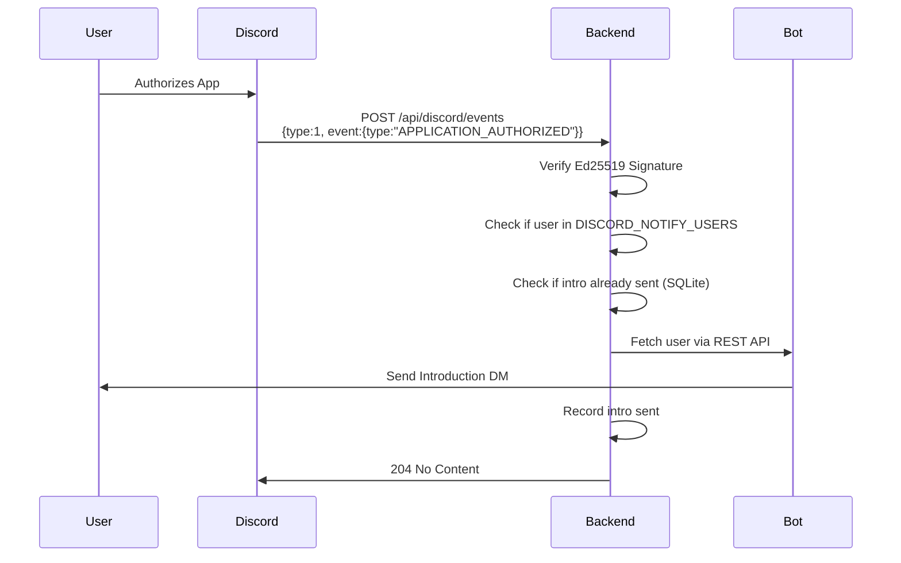

# Discord Webhook Events Setup Guide

This guide explains how to configure Discord's Webhook Events to automatically send introduction DMs when users authorize your app, eliminating the need to restart your backend server.

## Overview

Discord Webhook Events allow your app to receive real-time notifications when users authorize or deauthorize your application. This is particularly useful for user-installable apps where users can add your app directly to their account.

## Why Use Webhook Events?

**Problem:** Currently, intro DMs are only sent when the bot starts up. If you add a user to `DISCORD_NOTIFY_USERS` after the bot is running, they won't receive the intro until you restart the backend.

**Solution:** Webhook Events trigger immediately when a user authorizes your app, allowing instant intro DM delivery without server restarts.

## Setup Steps

### 1. Enable User Install in Discord Developer Portal

1. Go to [Discord Developer Portal](https://discord.com/developers/applications)
2. Select your application
3. Navigate to **Installation** tab
4. Enable **User Install**
5. Configure installation contexts as needed

### 2. Set Up Webhook Events URL

1. In the Developer Portal, go to **Webhooks (Events)** tab
2. Add your **Events URL**: `https://your-domain.com/api/discord/events`
   - Must be publicly accessible HTTPS endpoint
   - Must verify Discord's signature (handled automatically)
3. Subscribe to these events:
   - **APPLICATION_AUTHORIZED** - User adds your app
   - **APPLICATION_DEAUTHORIZED** - User removes your app (optional)

### 3. Get Your Public Key

1. In Developer Portal, go to **General Information**
2. Copy your **Public Key**
3. Add to your `.env` file:

```env
DISCORD_PUBLIC_KEY=your_public_key_here
```

### 4. Configure Notification Recipients

Make sure your `.env` has:

```env
# Discord Bot Configuration
DISCORD_BOT_TOKEN=your_bot_token
DISCORD_CLIENT_ID=your_client_id
DISCORD_PUBLIC_KEY=your_public_key  # NEW - Required for webhook events

# Notification Configuration
NOTIFICATION_1_TYPE=discord_bot
DISCORD_NOTIFY_USERS=123456789012345678,987654321098765432

# Server Configuration (used in intro messages)
SERVER_API_URL=https://your-server.com
SERVER_API_KEY=your_webhook_id
```

### 5. Verify Endpoint Configuration

The endpoint is automatically registered at: `/api/discord/events`

Test it by:
1. Having a user authorize your app
2. Check your backend logs for:
   ```
   [discordWebhookEvents] APPLICATION_AUTHORIZED event received
   [discordWebhookEvents] User username (user_id) authorized the application
   ```

## How It Works



## Event Processing Flow

1. **Signature Verification**: All events are verified using Ed25519 signatures with `X-Signature-Ed25519` and `X-Signature-Timestamp` headers
2. **Payload Parsing**: Webhook events have nested structure: `payload.type` (0=PING, 1=Event) → `payload.event.type` (event name) → `payload.event.data` (event-specific data)
3. **PING Acknowledgment**: PING events (type 0) respond with `204 No Content`
4. **Idempotency**: Duplicate events are detected using event type + timestamp combination
5. **User Extraction**: User data is in `payload.event.data.user` for APPLICATION_AUTHORIZED events
6. **User Check**: Only users in `DISCORD_NOTIFY_USERS` receive intros
7. **Duplicate Prevention**: SQLite tracks who received intros to prevent spam
8. **REST API DM**: Uses Discord REST API to send DMs (works without shared servers)
9. **Response Timing**: All responses sent within 3 seconds with `204 No Content`

## Security Features

- ✅ **Signature Verification**: Every request validated using your public key
- ✅ **Idempotency**: Prevents duplicate processing if Discord retries
- ✅ **Rate Limiting**: Automatic retry handling with exponential backoff
- ✅ **DM Failure Handling**: Graceful handling if user blocks DMs

## Testing

### Test with cURL

```bash
# Note: You cannot easily test this with cURL because Discord's signature
# verification requires a valid Ed25519 signature.

# Instead, test by:
# 1. Having a test user authorize your app
# 2. Monitoring your backend logs
```

### Debugging

Enable debug logs:

```env
DEBUG=TRUE
```

Then monitor logs for:
- `Discord PING event received` - Endpoint verification
- `APPLICATION_AUTHORIZED event received` - User authorization
- `User {id} is in notify list` - User will receive intro
- `Successfully sent intro DM to user {id}` - Intro sent

## Troubleshooting

### Webhook Events Not Received

**Check:**
1. Events URL is publicly accessible HTTPS
2. URL matches exactly: `https://your-domain.com/api/discord/events`
3. `DISCORD_PUBLIC_KEY` is set correctly in `.env`
4. Server is running and route is mounted

**Test Discord's PING:**
Discord sends a PING (type 0) when you save the Events URL. You should see:
```
[discordWebhookEvents] Discord PING event received
[discordWebhookEvents] Webhook payload type: 0
```
And your endpoint should respond with `204 No Content`.

### User Not Receiving Intro

**Check:**
1. User ID is in `DISCORD_NOTIFY_USERS`
2. User hasn't already received intro (check SQLite: `discord_intros.db`)
3. User allows DMs from apps
4. Bot token is valid

**Clear intro record to resend:**
```javascript
import { initializeDatabase } from './node/sqliteDatabase.mjs';
import { removeIntroRecord } from './node/sqlite/discordIntros.mjs';

const db = await initializeDatabase('discordIntros');
await removeIntroRecord(db, 'USER_ID_HERE');
```

### Signature Verification Fails

**Check:**
1. `DISCORD_PUBLIC_KEY` matches the one in Developer Portal
2. No extra whitespace in the environment variable
3. Key is the public key, not the bot token

### 403 Forbidden on DM Send

**Possible causes:**
- User has blocked DMs from apps
- User has closed DMs from server members (if using guild install)
- Bot lacks proper OAuth2 scopes

**Note:** With user-install, you don't need shared servers for DMs!

## Environment Variables Reference

| Variable | Required | Description |
|----------|----------|-------------|
| `DISCORD_BOT_TOKEN` | ✅ | Bot token for sending DMs |
| `DISCORD_CLIENT_ID` | ✅ | Application client ID |
| `DISCORD_PUBLIC_KEY` | ✅ | Public key for signature verification |
| `DISCORD_NOTIFY_USERS` | ✅ | Comma-separated user IDs |
| `SERVER_API_URL` | ✅ | Your server URL (shown in intro) |
| `NOTIFICATION_1_TYPE` | ✅ | Must be `discord_bot` |
| `DEBUG` | ❌ | Set to `TRUE` for verbose logging |

## FAQ

**Q: Do I still need the bot ready event handler?**
A: Yes! The ready event sends intros on bot startup. Webhook events handle authorization after startup.

**Q: Will users receive duplicate intros?**
A: No. SQLite tracks sent intros to prevent duplicates.

**Q: Can I use this with guild-installed bots?**
A: Yes, but webhook events are most useful for user-install apps.

**Q: What happens if the webhook endpoint is down?**
A: Discord will retry with exponential backoff for up to 10 minutes. If your app fails to respond too often, Discord will stop sending events and notify you via email.

**Q: What's the correct payload structure?**
A: Discord webhook events use a nested structure:
```json
{
  "version": 1,
  "application_id": "your_app_id",
  "type": 1,
  "event": {
    "type": "APPLICATION_AUTHORIZED",
    "timestamp": "2024-10-18T14:42:53.064834",
    "data": {
      "integration_type": 1,
      "user": { "id": "...", "username": "..." },
      "scopes": ["applications.commands"]
    }
  }
}
```

**Q: Why 204 No Content instead of 200 OK?**
A: Discord's documentation specifies that webhook events must respond with `204` status code within 3 seconds to acknowledge receipt.

**Q: How do I test without publishing my app?**
A: Add test users to your Development Team in the Developer Portal.

## Related Documentation

- [Discord Webhook Events Docs](https://discord.com/developers/docs/events/webhook-events)
- [User-Installable Apps Guide](https://discord.com/developers/docs/tutorials/developing-a-user-installable-app)
- [Discord.js Documentation](https://discord.js.org/)

## Support

For issues:
1. Check backend logs with `DEBUG=TRUE`
2. Verify all environment variables
3. Test with a fresh user who hasn't authorized before
4. Check SQLite database for existing intro records