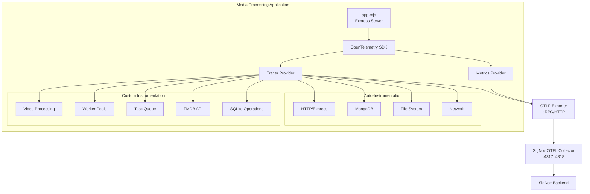

# OpenTelemetry Instrumentation Plan

## Overview

This document outlines the implementation plan for adding comprehensive OpenTelemetry (OTEL) instrumentation to the media processing application. The application will send telemetry data to a SigNoz OpenTelemetry Collector for distributed tracing, metrics, and observability.

## Target Environment

- **Observability Platform**: SigNoz
- **Collector**: signoz-otel-collector
- **OTLP Endpoints**:
  - gRPC: Port 4317
  - HTTP: Port 4318
- **Network**: Docker network (signoz-network) or localhost depending on deployment

## Architecture Overview



## Implementation Plan

### Phase 1: Core Setup

#### 1.1 Install Required Packages

Install OpenTelemetry SDK and instrumentation libraries:

```bash
cd node
npm install --save \
  @opentelemetry/sdk-node \
  @opentelemetry/auto-instrumentations-node \
  @opentelemetry/exporter-trace-otlp-grpc \
  @opentelemetry/exporter-trace-otlp-http \
  @opentelemetry/exporter-metrics-otlp-grpc \
  @opentelemetry/instrumentation \
  @opentelemetry/resources \
  @opentelemetry/semantic-conventions
```

**Packages Breakdown**:
- `@opentelemetry/sdk-node`: Core OpenTelemetry SDK for Node.js
- `@opentelemetry/auto-instrumentations-node`: Automatic instrumentation for Express, HTTP, MongoDB, etc.
- `@opentelemetry/exporter-trace-otlp-grpc`: OTLP gRPC exporter for traces
- `@opentelemetry/exporter-trace-otlp-http`: OTLP HTTP exporter (fallback option)
- `@opentelemetry/exporter-metrics-otlp-grpc`: OTLP gRPC exporter for metrics
- `@opentelemetry/instrumentation`: Base instrumentation library
- `@opentelemetry/resources`: Resource detection and service metadata
- `@opentelemetry/semantic-conventions`: Standardized attribute names

#### 1.2 Create OpenTelemetry Initialization Module

**File**: [`node/lib/telemetry.mjs`](node/lib/telemetry.mjs)

This module must be imported **before** any other application code to ensure proper instrumentation.

**Key Features**:
- Configure OTLP exporter with SigNoz collector endpoints
- Set service name and resource attributes
- Enable auto-instrumentation for Express, MongoDB, HTTP, DNS, FS
- Support for both development (console) and production (OTLP) modes
- Graceful shutdown handling
- Environment-based configuration

**Resource Attributes**:
- `service.name`: "media-processor" (configurable)
- `service.version`: From package.json
- `deployment.environment`: dev/staging/production
- `host.name`: Server hostname
- `service.instance.id`: Unique instance identifier

#### 1.3 Update Application Startup

**File**: [`node/app.mjs`](node/app.mjs)

**Critical Change**: Import telemetry initialization **first**, before any other imports:

```javascript
// MUST BE FIRST - Initialize OpenTelemetry before any other imports
import './lib/telemetry.mjs';

// Now import everything else
import express from "express";
import { scheduleJob } from "node-schedule";
// ... rest of imports
```

This ensures that all instrumentation hooks are in place before any libraries are loaded.

#### 1.4 Environment Configuration

**File**: [`.env.example`](.env.example)

Add OpenTelemetry configuration variables:

```bash
# OpenTelemetry Configuration
OTEL_ENABLED=true                           # Enable/disable OpenTelemetry
OTEL_SERVICE_NAME=media-processor          # Service name in SigNoz
OTEL_EXPORTER_OTLP_ENDPOINT=http://localhost:4317  # gRPC endpoint
OTEL_EXPORTER_OTLP_PROTOCOL=grpc           # grpc or http/protobuf
OTEL_TRACES_SAMPLER=parentbased_always_on  # Sampling strategy
OTEL_TRACES_SAMPLER_ARG=1.0                # Sample 100% of traces
OTEL_RESOURCE_ATTRIBUTES=deployment.environment=production
OTEL_LOG_LEVEL=info                        # debug, info, warn, error
```

### Phase 2: Custom Instrumentation

#### 2.1 Video Processing Instrumentation

**Files to Instrument**:
- [`node/videoHandler.mjs`](node/videoHandler.mjs)
- [`node/ffmpeg/transcode.mjs`](node/ffmpeg/transcode.mjs)
- [`node/ffmpeg/ffmpeg.mjs`](node/ffmpeg/ffmpeg.mjs)
- [`node/ffmpeg/ffprobe.mjs`](node/ffmpeg/ffprobe.mjs)
- [`node/sprite.mjs`](node/sprite.mjs)
- [`node/sprite-route.mjs`](node/sprite-route.mjs)

**Spans to Add**:
- `video.transcode` - FFmpeg transcoding operations
  - Attributes: `video.path`, `video.format`, `video.codec`, `video.duration_ms`
- `video.probe` - FFprobe metadata extraction
  - Attributes: `video.path`, `video.size_bytes`, `probe.duration_ms`
- `video.sprite.generate` - Sprite sheet generation
  - Attributes: `video.path`, `sprite.frame_count`, `sprite.dimensions`
- `video.frame.extract` - Individual frame extraction
  - Attributes: `video.path`, `frame.timestamp`, `frame.format`
- `video.clip.generate` - Video clip generation
  - Attributes: `video.path`, `clip.start_time`, `clip.duration`

**Example Pattern**:
```javascript
import { trace } from '@opentelemetry/api';

const tracer = trace.getTracer('video-processor');

export async function transcodeVideo(inputPath, options) {
  const span = tracer.startSpan('video.transcode', {
    attributes: {
      'video.path': inputPath,
      'video.codec': options.codec,
      'video.format': options.format
    }
  });

  try {
    const result = await performTranscode(inputPath, options);
    span.setAttributes({
      'video.output_size_bytes': result.size,
      'video.duration_ms': result.duration
    });
    span.setStatus({ code: SpanStatusCode.OK });
    return result;
  } catch (error) {
    span.recordException(error);
    span.setStatus({ 
      code: SpanStatusCode.ERROR, 
      message: error.message 
    });
    throw error;
  } finally {
    span.end();
  }
}
```

#### 2.2 Worker Pool Instrumentation

**Files to Instrument**:
- [`node/lib/blurhash-pool.mjs`](node/lib/blurhash-pool.mjs)
- [`node/workers/blurhash-worker.mjs`](node/workers/blurhash-worker.mjs)
- [`node/snapshotWorker.js`](node/snapshotWorker.js)

**Spans to Add**:
- `worker.pool.create` - Worker pool initialization
  - Attributes: `worker.type`, `worker.min_threads`, `worker.max_threads`
- `worker.task.queue` - Task queuing
  - Attributes: `worker.type`, `task.id`, `queue.depth`
- `worker.task.execute` - Task execution in worker
  - Attributes: `worker.thread_id`, `task.type`, `task.duration_ms`
- `blurhash.generate` - Blurhash generation
  - Attributes: `image.path`, `image.width`, `image.height`, `blurhash.components`

**Special Considerations**:
- Use context propagation across worker threads
- Track queue depth and worker utilization as metrics
- Monitor worker thread lifecycle events

#### 2.3 Database Instrumentation

**Files to Instrument**:
- [`node/database.mjs`](node/database.mjs) - MongoDB operations
- [`node/sqliteDatabase.mjs`](node/sqliteDatabase.mjs) - SQLite operations
- [`node/sqlite/*.mjs`](node/sqlite/) - All SQLite modules

**Spans to Add**:

**MongoDB**:
- `db.mongo.connect` - Connection establishment
- `db.mongo.query` - Generic query operations
- Auto-instrumented by `@opentelemetry/instrumentation-mongodb`

**SQLite**:
- `db.sqlite.query` - SQLite query execution
  - Attributes: `db.statement`, `db.operation`, `db.rows_affected`
- `db.sqlite.transaction` - Transaction operations
  - Attributes: `db.transaction.type` (read/write)
- `db.sqlite.initialize` - Database initialization
- `db.blurhash.generate` - Blurhash hash generation queries
- `db.metadata.hash.update` - Metadata hash updates

**Example Pattern for SQLite**:
```javascript
export function withDbSpan(operationName, fn) {
  const span = tracer.startSpan(`db.sqlite.${operationName}`);
  
  return async (...args) => {
    try {
      const result = await fn(...args);
      span.setStatus({ code: SpanStatusCode.OK });
      return result;
    } catch (error) {
      span.recordException(error);
      span.setStatus({ 
        code: SpanStatusCode.ERROR, 
        message: error.message 
      });
      throw error;
    } finally {
      span.end();
    }
  };
}
```

#### 2.4 TMDB API Instrumentation

**Files to Instrument**:
- [`node/utils/tmdb.mjs`](node/utils/tmdb.mjs)
- [`node/utils/tmdbBlurhash.mjs`](node/utils/tmdbBlurhash.mjs)
- [`node/utils/imageDownloader.mjs`](node/utils/imageDownloader.mjs)
- [`node/routes/tmdb.mjs`](node/routes/tmdb.mjs)

**Spans to Add**:
- `tmdb.api.request` - TMDB API requests
  - Attributes: `http.url`, `tmdb.media_type`, `tmdb.media_id`, `http.status_code`
- `tmdb.metadata.fetch` - Metadata fetching
  - Attributes: `tmdb.media_type`, `tmdb.id`, `tmdb.language`
- `tmdb.image.download` - Image downloads
  - Attributes: `image.url`, `image.type` (poster/backdrop), `image.size_bytes`
- `tmdb.blurhash.enhance` - Blurhash enhancement
  - Attributes: `tmdb.response_type`, `image.count`, `processing.duration_ms`
- `tmdb.cache.lookup` - Cache operations
  - Attributes: `cache.hit`, `cache.key`, `cache.ttl`

**HTTP Client Auto-Instrumentation**:
- TMDB API calls via `axios` are automatically instrumented
- Add custom attributes for TMDB-specific context

#### 2.5 Task Queue Instrumentation

**Files to Instrument**:
- [`node/lib/taskManager.mjs`](node/lib/taskManager.mjs)
- [`node/sqlite/processTracking.mjs`](node/sqlite/processTracking.mjs)

**Spans to Add**:
- `task.enqueue` - Task queuing
  - Attributes: `task.type`, `task.id`, `task.priority`, `queue.depth`
- `task.execute` - Task execution
  - Attributes: `task.type`, `task.id`, `task.duration_ms`, `task.status`
- `task.process.track` - Process tracking
  - Attributes: `process.file_key`, `process.status`, `process.type`
- `scanner.media.scan` - Media scanning operations
  - Attributes: `scanner.media_type`, `scanner.path`, `scanner.items_found`

#### 2.6 Media Scanner Instrumentation

**Files to Instrument**:
- [`node/components/media-scanner/index.mjs`](node/components/media-scanner/index.mjs)
- [`node/components/media-scanner/domain/movie-scanner.mjs`](node/components/media-scanner/domain/movie-scanner.mjs)
- [`node/components/media-scanner/domain/tv-scanner.mjs`](node/components/media-scanner/domain/tv-scanner.mjs)

**Spans to Add**:
- `scanner.movies.scan` - Movie directory scanning
  - Attributes: `scanner.path`, `scanner.movies_found`, `scanner.duration_ms`
- `scanner.tv.scan` - TV show directory scanning
  - Attributes: `scanner.path`, `scanner.shows_found`, `scanner.episodes_found`
- `scanner.file.hash` - File hashing operations
  - Attributes: `file.path`, `hash.algorithm`, `hash.value`

### Phase 3: Metrics Collection

#### 3.1 System Metrics

**Metrics to Collect**:
- `system.cpu.utilization` (gauge) - CPU usage percentage
- `system.memory.usage` (gauge) - Memory usage in bytes
- `system.memory.utilization` (gauge) - Memory usage percentage
- `system.disk.usage` (gauge) - Disk usage in bytes
- `system.disk.utilization` (gauge) - Disk usage percentage

**Integration Point**: [`node/routes/systemStatus.mjs`](node/routes/systemStatus.mjs)

#### 3.2 Application Metrics

**Metrics to Collect**:
- `http.server.request.duration` (histogram) - Request duration
- `http.server.active_requests` (gauge) - Active requests
- `video.transcode.duration` (histogram) - Transcoding duration
- `video.transcode.queue_depth` (gauge) - Transcode queue depth
- `worker.pool.utilization` (gauge) - Worker pool utilization
- `worker.pool.queue_depth` (gauge) - Worker queue depth
- `db.query.duration` (histogram) - Database query duration
- `cache.hit_ratio` (gauge) - Cache hit ratio
- `task.queue.depth` (gauge) - Task queue depth
- `task.execution.duration` (histogram) - Task execution duration

#### 3.3 Business Metrics

**Metrics to Collect**:
- `media.movies.total` (counter) - Total movies in library
- `media.tv_shows.total` (counter) - Total TV shows
- `media.episodes.total` (counter) - Total episodes
- `tmdb.api.requests` (counter) - TMDB API request count
- `tmdb.api.errors` (counter) - TMDB API error count
- `blurhash.generated` (counter) - Blurhashes generated
- `scan.completed` (counter) - Media scans completed

### Phase 4: Winston Logger Integration

#### 4.1 Correlate Logs with Traces

**File**: [`node/lib/logger.mjs`](node/lib/logger.mjs)

**Enhancement**: Add trace context to Winston logs

```javascript
import { trace, context } from '@opentelemetry/api';

// Custom format to add trace context
const traceContextFormat = format((info) => {
  const span = trace.getSpan(context.active());
  if (span) {
    const spanContext = span.spanContext();
    info.trace_id = spanContext.traceId;
    info.span_id = spanContext.spanId;
    info.trace_flags = spanContext.traceFlags;
  }
  return info;
});

// Add to format chain
format.combine(
  traceContextFormat(),
  format.timestamp({ format: 'YYYY-MM-DD HH:mm:ss' }),
  format.errors({ stack: true }),
  format.splat(),
  format.json()
)
```

**Benefits**:
- Correlate logs with traces in SigNoz
- Click from trace to related logs
- Search logs by trace ID

### Phase 5: Docker Integration

#### 5.1 Update Dockerfile

**File**: [`Dockerfile`](Dockerfile)

**Changes Required**:
1. Add OpenTelemetry packages to npm install
2. Add environment variable support
3. Ensure network connectivity to SigNoz collector

**No code changes needed** - OpenTelemetry packages are installed via package.json

#### 5.2 Docker Compose Integration

If using Docker Compose, ensure the application container:
1. Is on the same network as `signoz-network`
2. Can resolve `otel-collector` hostname
3. Has proper environment variables set

**Example Docker Compose Service**:
```yaml
media-processor:
  build: .
  environment:
    - OTEL_ENABLED=true
    - OTEL_SERVICE_NAME=media-processor
    - OTEL_EXPORTER_OTLP_ENDPOINT=http://otel-collector:4317
    - OTEL_EXPORTER_OTLP_PROTOCOL=grpc
    - OTEL_RESOURCE_ATTRIBUTES=deployment.environment=production
  networks:
    - signoz-network
  depends_on:
    - otel-collector
```

### Phase 6: Testing & Validation

#### 6.1 Development Testing

**Steps**:
1. Start SigNoz stack
2. Configure application with OTLP endpoint
3. Run application and generate traffic
4. Verify traces appear in SigNoz UI
5. Check for complete trace spans
6. Validate span attributes and relationships

#### 6.2 Verification Checklist

- [ ] Traces appear in SigNoz dashboard
- [ ] Spans have proper parent-child relationships
- [ ] Custom attributes are captured correctly
- [ ] Errors are recorded with exceptions
- [ ] Metrics are collected and visible
- [ ] Logs are correlated with traces
- [ ] Sampling rate is appropriate
- [ ] Performance impact is acceptable (<5% overhead)

#### 6.3 Performance Testing

**Monitor**:
- Application startup time (should increase minimally)
- Request latency (overhead should be <1ms per request)
- Memory usage (SDK adds ~10-20MB)
- CPU usage (instrumentation overhead <2%)

### Phase 7: Documentation

#### 7.1 Configuration Guide

Document:
- Environment variable options
- Exporter configuration
- Sampling strategies
- Resource attributes
- Troubleshooting common issues

#### 7.2 Development Guide

Document:
- How to add custom spans
- Span attribute conventions
- Context propagation patterns
- Best practices for instrumentation
- Testing instrumented code

#### 7.3 Operational Guide

Document:
- How to monitor trace data in SigNoz
- How to create custom dashboards
- Alert configuration
- Performance tuning
- Sampling configuration for high-volume scenarios

## Implementation Timeline

### Priority 1: Core Setup (Must Have)
1. Install packages
2. Create telemetry module
3. Configure OTLP exporter
4. Update application startup
5. Add environment variables
6. Test basic connectivity

### Priority 2: Critical Instrumentation (Should Have)
1. Video processing spans
2. Database operation spans
3. TMDB API spans
4. Task queue spans
5. Core metrics collection

### Priority 3: Enhanced Instrumentation (Nice to Have)
1. Worker pool detailed instrumentation
2. Business metrics
3. Advanced sampling strategies
4. Custom dashboards in SigNoz

### Priority 4: Advanced Features (Future)
1. Distributed tracing across services
2. Profiling integration
3. Advanced performance analysis
4. Custom exporters

## Key Considerations

### 1. Context Propagation

**Challenge**: Ensure trace context is propagated across:
- Async operations
- Worker threads (Piscina)
- Task queues
- Scheduled jobs

**Solution**: Use OpenTelemetry context API explicitly:
```javascript
import { context, propagation } from '@opentelemetry/api';

// Capture context before async boundary
const ctx = context.active();

// Restore context in callback
context.with(ctx, () => {
  // Your code here maintains trace context
});
```

### 2. Performance Impact

**Concerns**:
- Tracing overhead on high-throughput video operations
- Memory usage with many concurrent spans
- Network overhead sending telemetry data

**Mitigations**:
- Use sampling for high-volume operations
- Batch telemetry data export
- Set reasonable span attribute limits
- Monitor application performance metrics

### 3. Sampling Strategy

**Options**:
1. **Always On** (development): Sample 100% of traces
2. **Probabilistic** (production): Sample X% of traces
3. **Rate Limiting**: Limit traces per second
4. **Parent-Based**: Follow parent span's sampling decision

**Recommendation**: Start with `parentbased_always_on` for development, then adjust based on traffic volume.

### 4. Sensitive Data

**Important**: Avoid capturing sensitive data in span attributes:
- User credentials
- Video file contents
- API keys
- Personal information

**Best Practices**:
- Hash or truncate file paths
- Redact sensitive query parameters
- Use resource IDs instead of full data
- Review span attributes before production

### 5. Error Handling

**Pattern**: Always record exceptions and set span status:
```javascript
try {
  await operation();
  span.setStatus({ code: SpanStatusCode.OK });
} catch (error) {
  span.recordException(error);
  span.setStatus({ 
    code: SpanStatusCode.ERROR, 
    message: error.message 
  });
  throw error;
} finally {
  span.end();
}
```

## File Structure After Implementation

```
node/
├── lib/
│   ├── telemetry.mjs          ← NEW: OpenTelemetry initialization
│   ├── tracer.mjs             ← NEW: Tracer helper utilities
│   ├── metrics.mjs            ← NEW: Metrics helper utilities
│   └── logger.mjs             ← MODIFIED: Add trace context
├── app.mjs                    ← MODIFIED: Import telemetry first
├── package.json               ← MODIFIED: Add OTEL dependencies
└── ...

.env.example                   ← MODIFIED: Add OTEL configuration
plans/
└── OPENTELEMETRY_INSTRUMENTATION.md  ← THIS FILE
docs/
└── OPENTELEMETRY_GUIDE.md    ← NEW: User-facing documentation
```

## Success Criteria

✅ **Implementation Success**:
1. All traces appear in SigNoz with proper structure
2. Custom spans for video, DB, and API operations
3. Metrics collection functional
4. Logs correlated with traces
5. Performance overhead <5%
6. Zero data loss during normal operation

✅ **Operational Success**:
1. Team can navigate traces in SigNoz
2. Can identify performance bottlenecks
3. Can debug issues using trace data
4. Custom dashboards display key metrics
5. Alerts configured for critical issues

## Resources

### OpenTelemetry Documentation
- [OpenTelemetry Node.js](https://opentelemetry.io/docs/instrumentation/js/getting-started/nodejs/)
- [Semantic Conventions](https://opentelemetry.io/docs/specs/semconv/)
- [Auto-Instrumentation](https://github.com/open-telemetry/opentelemetry-js-contrib/tree/main/metapackages/auto-instrumentations-node)

### SigNoz Documentation
- [SigNoz Node.js Instrumentation](https://signoz.io/docs/instrumentation/nodejs/)
- [SigNoz OpenTelemetry Collector](https://signoz.io/docs/operate/configuration/)
- [Custom Metrics](https://signoz.io/docs/userguide/metrics/)

### Related Internal Documentation
- [Logger Documentation](docs/SESSION_CACHE_IMPLEMENTATION.md)
- [Task Manager](node/lib/taskManager.mjs)
- [Video Handler](node/videoHandler.mjs)

## Next Steps

1. **Review this plan** with the team
2. **Prioritize instrumentation** based on observability needs
3. **Set up development environment** with SigNoz access
4. **Begin Phase 1** implementation (core setup)
5. **Iterate on custom instrumentation** based on data visibility needs

## Questions to Consider

Before implementation, consider:
1. What are the most critical operations to trace?
2. What metrics matter most for your use case?
3. What sampling rate is appropriate for your traffic volume?
4. Do you need distributed tracing across multiple services?
5. What alerting rules should be configured?
6. Who will monitor and analyze the telemetry data?
